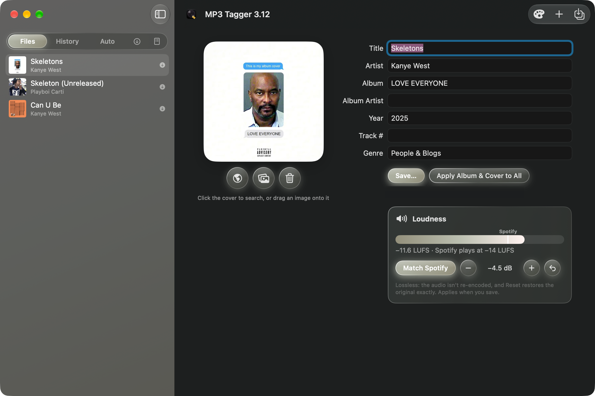
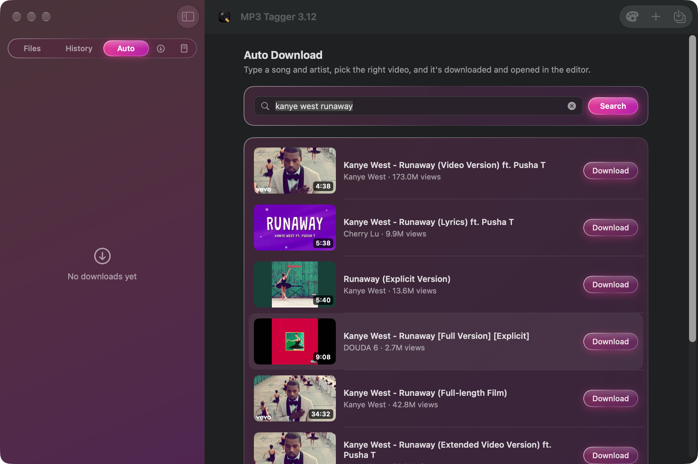
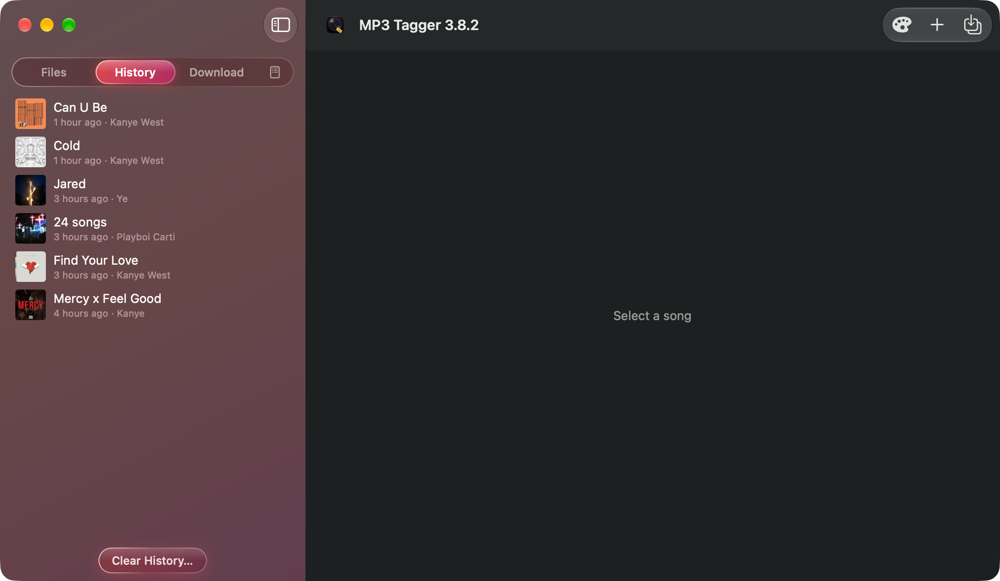
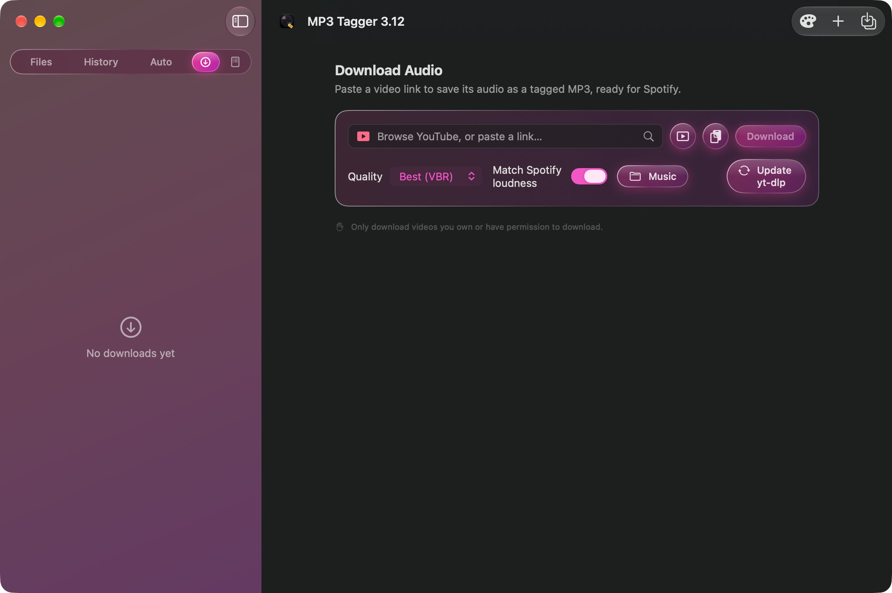
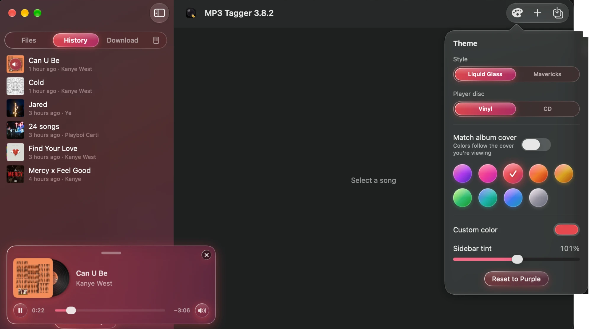

# MP3 Tagger

hi i made claude make me a mac os mp3 tagger, mostly for spotify, look at the screenshots to see how it looks like, its vibecoded asf, but i needed myself an app like that, so i made it and customized it to my liking, but im sharing it if someone finds it useful. im not taking any credit for the code. 

ill update it regularly since its a personnal project i will always make changes lol 
SCREENSHOT CAN BE FEW VERSION BEHIND SRYYYY</3

## Features

**Tag editing**
- Edit title, artist, album, album artist, year, track number, genre and cover art
- Saves as ID3v2.3, the version Spotify's local files read best
- Drag and drop songs or whole folders; Save, Save As, and Save All to a folder
- "Apply Album & Cover to All" for tagging a whole album at once

**Cover art**
- Drag an image onto the cover, or pick one from a file
- Built-in search: official album art from Apple's catalog, or web image search (right-click → Use as Cover Art)
- Liquid glass "pour" animation when the cover changes

**Loudness**
- Measures loudness in LUFS (the EBU R128 / BS.1770 method)
- "Match Spotify" sets songs to −14 LUFS, like Spotify plays them, or adjust in ±1.5 dB steps
- Lossless (MP3Gain-style): the audio isn't re-encoded, and Reset restores the original exactly

**Playback**
- Picture-in-picture mini player: drag it anywhere, it snaps to the corners
- A spinning vinyl record (33⅓ RPM) or CD (real CD speed, Yeezus-style reflections) slides out from behind the cover
- Play/pause, song position slider, slide-out volume with mute, and a ✕ to close
- Dynamic Island-style visualizer that moves with the song's real bass, mids and treble, in the album cover's colors

**Auto (find & download)**
- Type a song and artist, and get the best YouTube matches with thumbnail, length, channel and views
- Click a thumbnail to hear the first 30 seconds
- Pick one: it downloads, cleans up the tags, matches Spotify loudness and opens in the editor so you can fix the cover

**Download**
- Paste a video link and get a tagged MP3 (uses yt-dlp and ffmpeg from Homebrew; install/update from the app)
- In-app YouTube browser with a built-in ad blocker; stays signed in
- Automatic cover, title cleanup and optional Spotify loudness matching
- Downloaded songs stay in the Files list across launches

**Help**
- ⓘ button next to the theme button: what each tab does, and click one to jump there

**History and changelog**
- History tab of every song you saved; click a cover to play it
- Changelog tab listing every version

**Themes**
- Liquid Glass style with 9 color presets, a custom color, sidebar tint, or colors that match the album cover
  (with nothing selected, they follow the song that's playing)
- Mavericks style: an OS X 10.9-inspired skeuomorphic look with the same layout
- Theme picker also switches the player disc between vinyl and CD







## Download

Grab the zip from the [latest release](https://github.com/silentrosehill/MP3Tagger/releases/latest), unzip it and drag **MP3 Tagger** into Applications.
Built for macOS 14 or newer, on Apple silicon and Intel Macs (tested on macOS 27).

The app isn't notarized by Apple, so the first time macOS will say it can't check it. Open **System Settings → Privacy & Security**,
scroll down and click **Open Anyway** (or run `xattr -dr com.apple.quarantine "/Applications/MP3 Tagger.app"` in Terminal).

## Build and install

```bash
./build.sh            # quick build for this Mac
./release.sh          # universal build + zip in dist/ for a release
ditto "MP3 Tagger.app" "/Applications/MP3 Tagger.app"
```

Needs only the Xcode Command Line Tools (`xcode-select --install`). The downloader also needs
`yt-dlp` and `ffmpeg` (`brew install yt-dlp ffmpeg`, or the Install button in the app's Download tab).

## Layout

- `Sources/` — the app (SwiftUI). `ID3.swift` reads/writes tags, `Loudness.swift` measures and adjusts volume.
- `Icon/` — icon drawing scripts (`make_icon_v3.swift` is the current icon) and the `.icns` files.
- `CHANGELOG.md` — every version; bundled into the app's Changelog tab.
